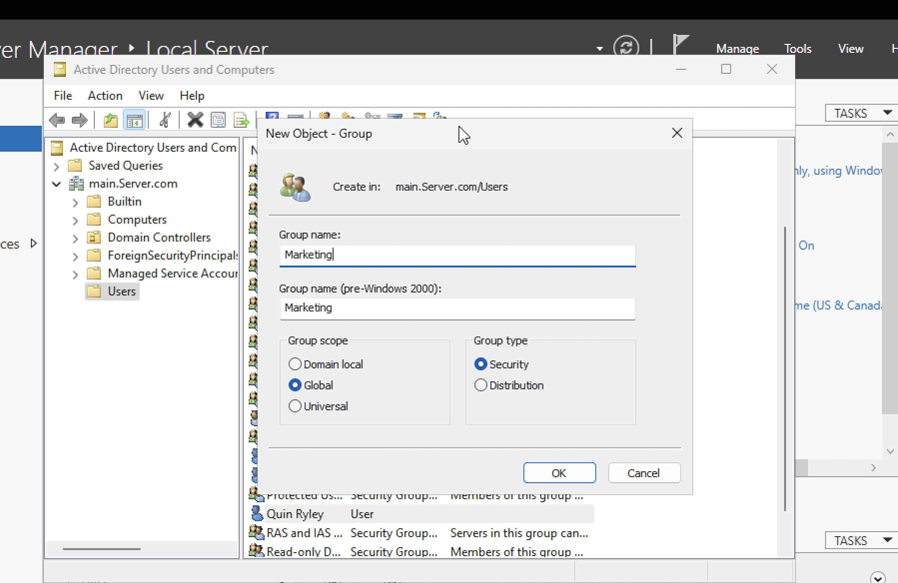
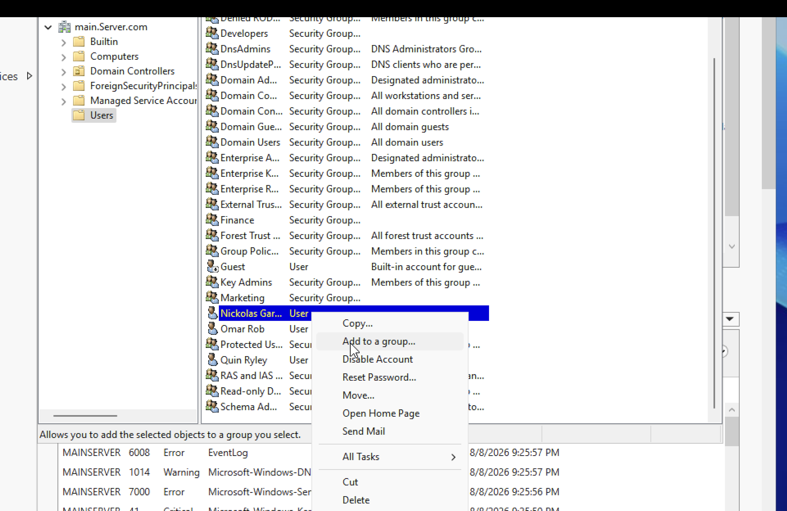
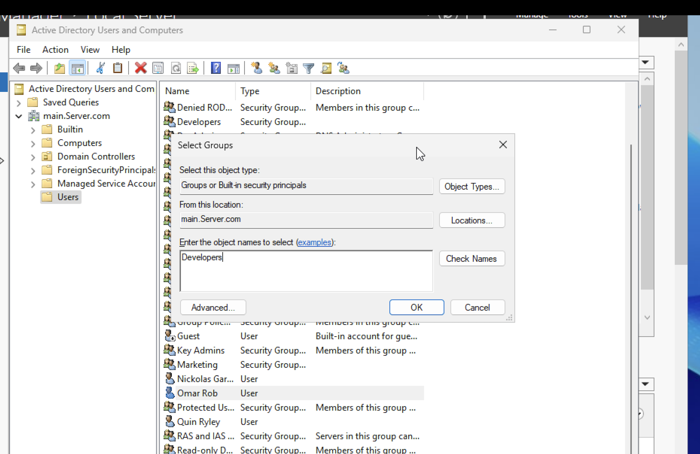
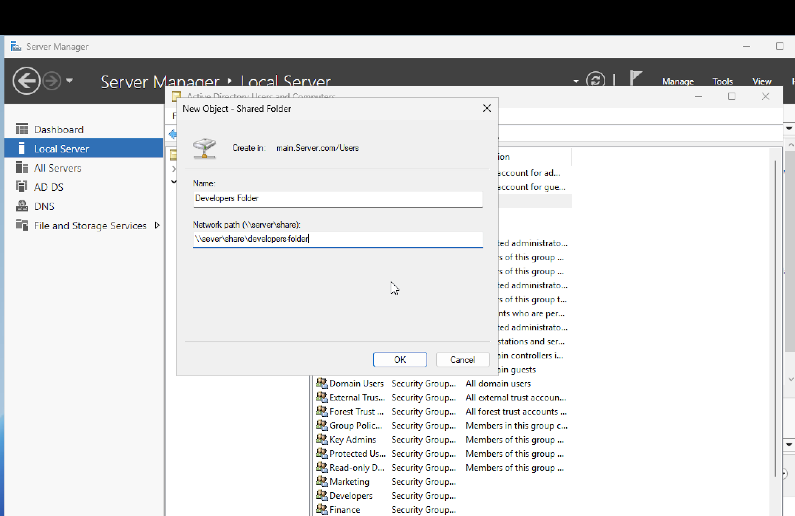
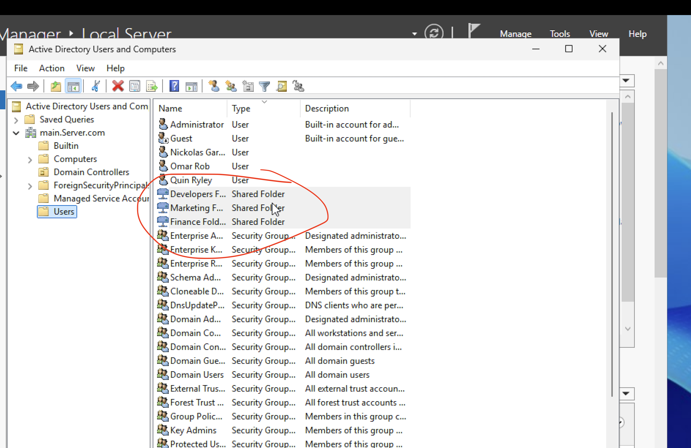
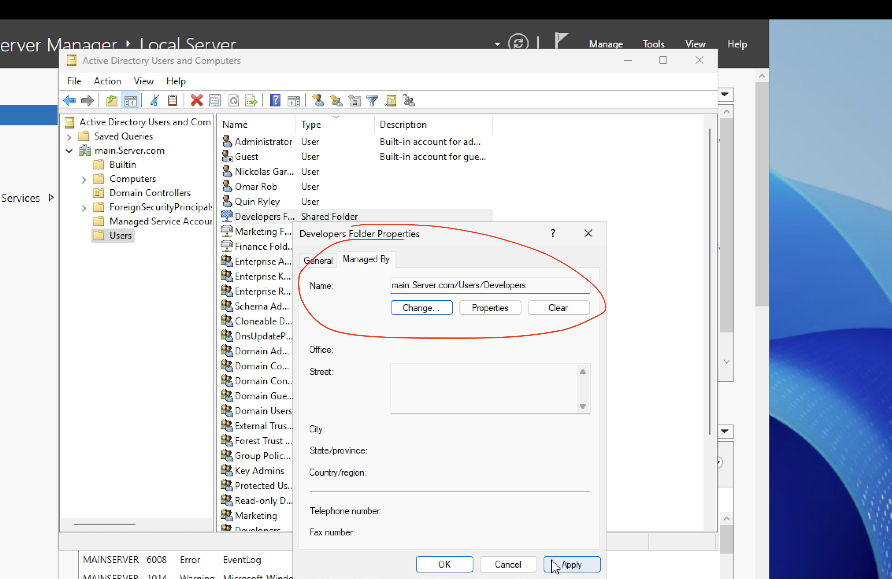

# Active Directory Lab

## Objective:
Simulate a company work environment by creating users & groups and setting permissions etc

## Creating Users
Created user accounts
- Nikolas Garey
- Omar Rob
- Quin Ryley

## Creating Groups
Created Three Different Groups:
- Marketing
- Finance 
- Developers

## Adding Users to the Groups

## Creating Shared Folders and Setting Permissions
Created 3 different Shared Folders:
- Marketing
- Finance 
- Developers

Set Permissions so that each respective group has access to the folder 

